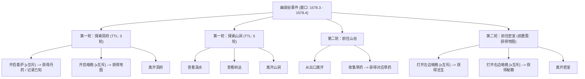

# 幽寂谷事件链与地图启动架构规范

> 归档路径：`AI交接/下级更新/地图事件链启动材料/`  
> 启动日期：2026-10-11  
> 关联资产：`南疆全域地图.jpg`、`仙姝堕.json`、`幽寂谷事件原始需求.txt`

---

## 一、需求背景与目标

为支撑《仙姝堕》世界观探索、地图多分支交互与探险事件流转，建立首个标准化多轮事件链试验场景——**幽寂谷事件**。
本规范明确事件树结构、节点互斥逻辑、轮次时效（TTL）机制，以及卡内历法从“初几”口径向“几月几日”标准化重构的技术路线。

---

## 二、历法口径重构规范（从“初几”至“几月几日”）

### 1. 现状问题
- 现有卡内历法采用“三月初三”、“五月初五”等传统初几描述。
- 中文字符串难以做数值区间比较与浮点步长递增，导致跨月判定、事件窗口（如 `1578.3 - 1578.4`）匹配与倒计时计算复杂度偏高。

### 2. 重构标准
- **显示标准**：统一规范为“仙盟历 XXXX年 X月 X日”（例如：仙盟历1578年3月15日）。
- **底层存储**：采用标准化时间对象与连续数值戳：
  ```javascript
  {
    calendar_type: "xianmeng",
    year: 1578,
    month: 3,
    day: 15,
    timestamp: 1578.0315 // 或以日为单位的连续整型数值，便于范围过滤：[1578.0300, 1578.0499]
  }
  ```
- **窗口判定口径**：
  - 幽寂谷事件触发窗口：`1578.3` 至 `1578.4`（即仙盟历1578年3月1日至1578年4月30日）。在此区间内，地图事件链处于激活就绪状态。

---

## 三、幽寂谷事件树结构与状态机规则

### 1. 结构树总览



---

### 2. 分轮次与节点详细规范

#### 【第一轮：区域探索】
1. **子节点 A：探索洞府**
   - **保留时效（TTL）**：持续 **3 轮对话**。自事件激活起计，经过 3 轮未互动则该选项超时关闭消失。
   - **内部行为项**：
     - `开启香炉 [x]`：互斥节点。触发后玩家获得特定丹药（写入纳戒物品栏/状态机 known 记录）。选择后，同轮次的 `开启暗格` 选项消失。
     - `开启暗格 [x]`：互斥节点。触发后玩家获得地图道具/线索（解锁后续第二轮密室前置条件）。选择后，同轮次的 `开启香炉` 选项消失。
     - `离开洞府`：常规流转节点，退出洞府子流。

2. **子节点 B：探索山涧**
   - **保留时效（TTL）**：持续 **5 轮对话**。自事件激活起计，经过 5 轮未互动则该选项超时关闭消失。
   - **内部行为项**：
     - `查看溪水`：触发溪流环境互动与剧情线索。
     - `查看树丛`：触发林地观察与环境线索。
     - `离开山涧`：常规流转节点，退出山涧子流。

---

#### 【第二轮：深入探索】
1. **子节点 C：前往山谷**
   - **触发条件**：常规流转无前置阻断。
   - **内部行为项**：
     - `从出口离开`：结算离开当前幽寂谷区域。
     - `收集草药`：触发草药采集判定，获得草药入包。

2. **子节点 D：前往密室**
   - **前置解锁条件**：**必须已获得地图**（即第一轮中探索洞府并选择 `开启暗格`）。若未持地图，则节点处于未解锁或隐藏状态。
   - **剧情展开**：呈现专属密室环境剧情与机缘二选一提示。
   - **内部行为项**：
     - `打开左边暗格 [x]`：互斥节点。获得专属法宝，同轮次右边暗格消失。
     - `打开右边暗格 [x]`：互斥节点。获得专属秘籍，同轮次左边暗格消失。
     - `离开密室`：结算离开密室分支。

---

## 四、状态机核心机制设计

### 1. 互斥组机制（Mutex Group `[x]`）
- **定义**：同一容器或同轮次内标记为 `[x]` 的节点归属同一互斥组。
- **行为规范**：
  - 互斥组内仅允许单次命中。
  - 一旦触发组内任意节点，系统将该互斥组状态标记为已完成（`consumed: true`），同时组内其余备选节点立即隐匿并不再可供选择。
  - 避免玩家在同一存档周目内同时获取同组所有机缘。

### 2. 轮次衰减与时效机制（TTL Mechanism）
- **定义**：节点创建时记录基准轮数 `created_turn` 与持续轮数 `ttl_turns`。
- **失效判定**：
  $$\text{current\_turn} - \text{created\_turn} \ge \text{ttl\_turns}$$
- **行为规范**：
  - 当超出指定对话轮次，且节点未被互动完成时，状态转为 `expired`，选项在渲染列表与提示词中自动剥离。
  - 确保探险决策的时效感与紧迫感，防止过期选项长期常驻。

### 3. 前置条件门禁机制（Prerequisite Gate）
- **定义**：节点配置 `requires` 判定器（如 `requires: ["inventory:map_youjigu"]` 或 `requires: ["known:map_youjigu"]`）。
- **行为规范**：
  - 未达成前置时，根据 UI 配置选择隐藏或置灰锁定。
  - 达成前置后实时动态开放交互。

---

## 五、交付文件清单

本材料包包含以下四项资产，均已在 Git 仓库内归档：

| 资产文件名 | 类型 | 规范说明 |
| :--- | :--- | :--- |
| `南疆全域地图.jpg` | 图片资产 | 南疆大地图地貌与探索区域参照底图 |
| `仙姝堕.json` | 角色卡数据 | 当前构建版本角色卡完整真源 JSON |
| `幽寂谷事件原始需求.txt` | 需求真源 | 用户给出的事件节点、互斥与时效原始指令 |
| `幽寂谷事件链与地图启动规范.md` | 技术文档 | 规范化事件树、互斥逻辑、TTL状态机设计与历法重构规划 |

