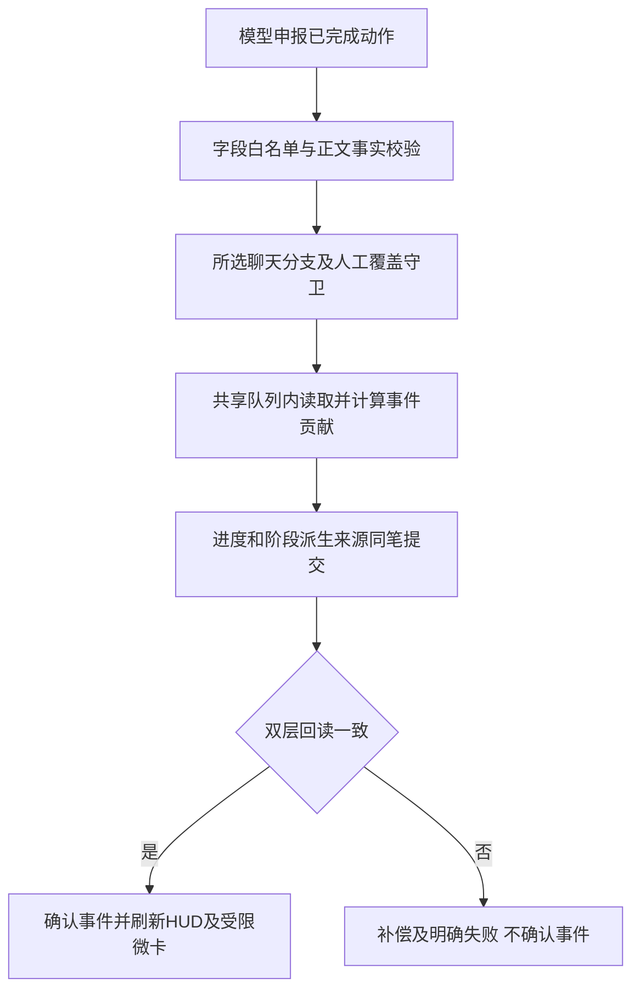

# MVU数值变量提案 RFC-001 审核

【身份：gpt｜日期：2026-10-10｜时间：00:03:34｜时区：Asia/Shanghai｜提案基线：14d1be2 / RFC记载f80200a】

**结论：认可“动作申报＋脚本计算、渐进展示、可纠错”的研究方向；RFC-001未闭合，不可按这份伪代码上线自动升阶。** 本轮是用户授权的设计审核，给出明确修改要求与下一步，不部署生产，不替用户制定新晋升规则。

## 一、直接回答三个请裁

| 请裁 | 结论 |
| --- | --- |
| 状态条动作申报是否可用 | 可以作为候选输入，采用明确事实枚举，去掉模型给的+1；必须绑定对象/行为者/当前已完成事实与证据，经过校验后由脚本决定是否计一次。标签不是事实证明。 |
| 满额点亮旧known是否存在竞争 | 存在。直接赋值绕过统一队列、人工覆盖、来源撤销和双层回读；还会与既有阶段写入竞争。只能作为同一状态转换中的**一种派生来源**，不能新起一个独立写入器。 |
| 一升二固定5次是否合适 | 没有本地原著/已确认规则证明“5是必要且充分”。可列为可配置试验参数；不能以原著名义固定，更不能仅凭次数取代现有晋升条件。先做记录展示，再决定玩法/条件，未定前不自动改阶段。 |

数值能提供进度感，并不能证明“零幻觉/彻底解决问答”。模型仍可能申报不存在的动作或复述旧事；JS只解决运算确定性，不能自动判定叙事真实性。

## 二、已复算的代码问题

`RFC001反例复算.cjs`执行提案的JavaScript块，15项检查留结果。`extractAction`没有实现，只用受控替身观察解析/数值行为；不把反例当成真实MVU插件测试。

0. **旧局未初始化直接抛错**：旧stat_data若无relic_progress，访问`[action.relicId]`就异常。先按schema迁移/初始化，本项失败隔离，不能带崩原状态条。
1. **新cur没保存回去**：`progress[id] || {…}`新建对象后缺`progress[id]=cur`。空存档连续处理五次仍无进度；这是伪代码的直接遗漏。
2. **重抽规则只写在说明，代码未实现**：对已存一阶对象每次`cur.infusion+1`，同一内容重复tick五次即升二；没有读取有效父快照/当前选中swipe/来源账本。现有去重能挡部分重复事件，不能替代持久事件语义或同楼编辑的重算。
3. **未成形也能升阶**：只检查action与缓存stage===1，没查成形、一阶、特殊前置、当前对象/知情/行为者资格；首期不得给未知对象默认一阶。
4. **绕人工回锁**：直接把known二阶段=true，未读人工纠错。现有`service.write(...,manual=false)`的protect可拦人工false，但这段根本没接入；计数/派生也须一致决定，不是只有最后一个bool被拦就算完整。
5. **stage双真源**：progress.stage=2与known四阶段=true可并存；反过来GM回到一阶但缓存stage=3，计数又停。当前有效阶段只从known＋人工覆盖解析，progress.stage可删除或仅作为可丢弃派生缓存。
6. **Clamp并非0~5**：`Math.min`不管负数；infusion为字符串`'1'`时`+1`成`'11'`，一次升满；target=0可一次升阶。必须严格整数/范围/策略版本校验，target由代码策略决定，不由模型或旧未验证数据供给。
7. **只有内存变更**：没有双层持久写入、来源日志、回读、失败补偿。助手getVariables返回克隆，修改对象不能视为落盘。
8. **宽容解析越界**：漏闭合的`([^\n\r]+)`会连下一XML字段吞入。多条互动只取第一条；例子/引文也会匹配。先隔离字段范围，明确重复/冲突/多对象处理规则；格式错只跳过本项，不能宽容到账。

## 三、必须接入现有一条写盘通路

本地上传状态机已有：`writeStat→__xsdCorrection.write`、共享聊天队列、同步updateVariablesWith、chat/message双层结构回读、补偿、人工覆盖、派生来源账本与撤销。新模块复用这些能力，不能另一个脚本/外部MVU同时直接更新同一批known/进度。

**读→算→提交必须在同一队列任务内**，从当时有效状态/所选分支和人工修订版本计算。把`+1`在队列外算好、最后仅排队写patch仍会覆盖中途GM/其他事件更新。扩展事务入口接受已校验事件及预期版本，在队列里计算这一笔完整patch。

事件账本、计数变化、阶段派生来源及必要known改变作为同一逻辑事务；调用现有补偿式双写并严格回读。成功之后才确认去重/刷新/提示。助手两个变量层不是跨层数据库事务，不得声称强原子；一层失败须明确补偿结果，补偿失败标部分写入并可受控重试，不能消耗事件后留下半份账。

现有capture只有chatId/messageId/epoch，**没有swipeId/正文hash**；watched也未含新进度。接入时补所选swipe、正文修订/父链版本、进度版本与manual修订守卫，防同楼换swipe仍通过旧预览。最新楼数未变不代表同一内容。

## 四、消息回溯与事件语义不能仅写N-1

助手4.11.3原生变量按`message.variables[message.swipe_id ?? 0]`读写。该契约已核源码tag/commit，现有证据另见二级面板实现/证据/酒馆助手4.11.3变量契约.md。它提供每swipe变量槽，**不自动替你建立可靠父快照或重放分支**。

- 物理N-1可能是玩家消息/系统消息、没有进度快照；应找到**当前所选分支的最近有效已提交进度快照**，检查版本/父链。没找到就新局初始化或旧局标未知，不把聊天层最新缓存当父快照，不能用0掩盖旧局历史缺失。
- 用聊天、稳定消息键、选中swipe、正文hash/修订及事件序号标识本楼贡献；hash是修订指纹，不是叙事事件身份。相同事件被下一楼回顾也不能再计一次，模型任意换eventId不能获得新点数。
- “严格单向累加”只能指一笔有效事件的正贡献，不能禁止swipe/编辑/撤销造成有效总分减少；B的回溯要求与A的字面单向承诺须统一。升阶重置只可重置展示/阶段缓存，不能抹掉已核事件历史，否则无法撤销贡献。
- 同楼重复渲染不变；编辑/swipe**替换本楼贡献**，不是在结果再加；A→B→A恢复所选A的结果，聊天层只是当前分支的镜像，不能叠加所有swipe。
- 编辑/删除历史楼、插入/移动消息、从旧楼分支，会改变后续状态。现有状态机只对最新楼记账，故须新增**进度命名空间内**的后继失效/重放机制；未完成前拒绝自动升阶，不重跑整套剧情/纳戒事件去制造副作用。
- GM覆盖来自独立人工修订层。不能从旧N-1整份stat_data覆盖当前状态，抹掉GM日期/身份/已知事实。仅重算本模块贡献；有独立来源的阶段必须保留。
- 只保留必要事件/小快照并定期checkpoint。不能每楼无界拷贝全stat_data/13件全表进变量或提示，必须有尺寸与导出迁移约束。

建议核心事件记录包含：schema/policyVersion、消息/分支修订、名器ID、持有者集合、行为者ID、已完成事实枚举、正文证据范围/摘要、审核状态、有效贡献、父快照版本；分数delta由代码生成，不由模型写。相关schema位置/持久化策略在RFC002说明，先不指定一套会与现有变量插件冲突的全层JSONPatch。

## 五、一个阶段真源、规则边界和派生撤销

1. `known`＋现有人工覆盖仍是阶段真源；数值记录有效互动进度。阶段继承/人物初登场二三阶/GM调整均从已有规则读取，不先创建一阶再强迫重练。
2. 显示名、DB短ID、HUD长ID、成形键、阶段键、持有者/别名必须显式映射。已有最新13件映射/词库已上传，别再凭字符串拼`relicName+'二阶段'`；灵犀的显示与成形/阶段注册键不同，烟霞无普通成形键，般若有额外前置。
3. 新计数只能是一升二的一个量化条件，现有“多次有效互动＋生理迎合”等规则如何结合须明写；纯数量不能强行生成迎合事实。三阶心理依附/奴种的合法路径与四阶各自条件继续由主人规则决定，不能同用0~5自动爬四阶。
4. 现有原始阶段申报、正文识别、继承、命令、GM都有写入路径。需要逐项说明：哪些自然路径要经过新资格判断、哪些保留合法例外。只新增一个阈值写入口，旧路径仍可直接二阶，既防不住越级，又没有形成真正上游。
5. 阈值达标产生来源`数值事件/策略版本`，不是永久裸true；重抽删掉贡献后，只移除此来源。另有人工/继承/有效独立事实来源则保留；无来源再撤依赖，不能清全部known或低阶历史。
6. 人工false优先于自动满额；显示可提示“进度达标，但人工回锁”。玩家选择“交还自动”再按正式规则重算，不自行消除锁。亮灭、归属、显示颜色与段位/世界日期继续独立，计数不得改变这些字段。
7. 规则改阈值需policyVersion和迁移说明，不在加载时突然给所有旧存档自动升阶。

## 六、协议、提示与HUD/GM

建议模型申报类似`<名器互动>稳定ID|行为者|已完成动作枚举</名器互动>`；具体枚举与证据范围在RFC002按真实设定定。不要同时接受“深度互动”“内射+1”“微变名器+1”等多个模糊分数协议；模型不供应总分、delta、target或stage。

仅取可信AI当前所选消息中限定Status_block内的字段，排除引文/写法示例/菜单及旧总结；检验主体、明确完成态、相关证据和资格。计划/假设/否定/回忆不增分；只申报无证据标待核，提供玩家纠正入口。宁漏记后纠正，不悄悄补成升阶。

格式瑕疵不能阻断原19字段和正文显示，但**不能解析成功就自动计分**。漏闭合时只在下个标签/行边界内尝试恢复，越界/冲突则跳过此项。限制每楼对象数/动作数/长度，明确定义一次有效事件；一楼多次或跨楼同一事件如何算是玩法约定，不默认每个+1都可信。先选一件适用对象试点，不能把同一种互动方式推广到乳类/双持有者等所有13件。

“19字段保持可用”不等于输出合同零改。模型必须知道新增动作协议与规则；进度微卡要从JS/变量模板在**发送前实际注入模型请求**，HUD DOM里看到2/5不能证明模型看到数据。已成形/已知且当前相关的对象才注入，不把所有NPC进度、名字和隐藏归属一次泄露。

微卡应说明“已核验2次/试验目标5；其他条件尚须满足”，不能承诺“再3次必晋升”。它可减少空泛回答，不能凭数字解决省略主语/话题歧义，更不能让角色突然获知自身未来秘密。

GM建议“设定核验计数/清除人工覆盖/撤销”，不要每点±直接落盘。仍先预览→确认，同笔记录来源/变化与计数-阶段一致性。满额按钮不能绕规则升阶，也不能自动改归属。GM面板由gpt接续现有窗口，不再做第二套UI。

阶段条已有known门可以继续使用；状态条协议、数值规则/资格、微卡注入、模型输出提示及对应校验会有必要改动。**撤回“现有246条世界书100%零改动”的保证**，列清最小修改范围。仅复用门表达式不等于业务规则不变。

## 七、旧局、中远期与真正MVU框架

旧局没有可核计数：已有阶段不降级，不猜满额，也不把未追溯的0当完整历史。标记“历史未知/自启用后记录”，玩家可校准；新局在明确启用点从0计。跨聊天不得继承人工覆盖，复制/导入/总结继承需要明确事件与历史迁移策略。

RFC实际写的是**原生状态机的数值扩展**，尚未给出第三方MVU插件名称/版本、schema、更新钩子或变量写入契约。建议首期走原生扩展。若确实要框架接入，先给其准确版本/接口/事件流及谁拥有哪些变量；禁止外部JSONPatch和现有状态机双写同一known/计数。Schema只校验类型也不能验证动作发生。

历史“纳戒不引MVU/JSONPatch”纪律不否定主人本次探索新数值模块，但此次没有授权改纳戒或把全部变量交第三方接管。`_chk_no_mvu`等旧门禁须按实际改动精确调整/新增合同，不通过删除门禁获取绿灯。GEMINI.md是Gemini纪律背景，不据此额外向用户索要本次已授权的审核许可。

中远期两项先不要接入：
- **心智0~100**不能把生理响应、感情认可、恐惧/屈从等压成一个累加值，更不能分数高就自动改变人格或写三阶。现有关系刻度不是已定义数值schema，先明确各维度含义/来源/可逆性与主人设定，不自动沿用“86即沉沦”。
- **破境资粮**要记“谁在何时获得一次性有效反馈”，按实际行为者及独立事件/对象去重。NPC已成形、别人占据、重复同一对象或改归属不能给玩家新初次收益。三件计数不是当前亮纹数；双持有者共用一名器如何计算须依主人规则明确。满足资格与实际完成突破分开，不能自动改修为/剧情/日期。

## 八、RFC002提交和验收

Gemini修订RFC002，一次提交：第一期具体对象/适用规则、是否仅记录/是否引真实插件、schema与完整ID映射引用、动作证据与一次事件定义、分支重放/旧局迁移、唯一写入与守卫、旧阶段入口处理表、阈值/生理条件关系、提示注入/最小源修改、GM人工覆盖及撤销、明确测试矩阵。无需再循环问“方向批准了吗”。

最新mingqi-db.js与max解禁运行时已上传且可读取，不重复索要。若本机状态机、输出合同/微卡注入源相对上传v1.2有新变，给这几件最新完整源＋SHA；只取相关技术件，不要整份项目/私聊/资源包。设计审核不等于授权直接安装第三方插件或发生产自动升阶版；先做独立纯函数/隔离只记录试点，再按已有开发授权完成候选验收。

必要验收：新局/旧局未知；同内容重绘和重启；swipe A→B→A；同楼编辑与历史楼编辑/删除/分支；N-1是用户消息/快照缺；事件在下楼回顾；无证据/否定/计划/示例/截断/重复标签；未成形/特殊前置/初登场高阶；非法整数/策略版本；GM回锁/调阶段/调计数/撤销；事件与GM并发、同楼切swipe/切聊天、双写任一层失败及重试；阈值来源撤回且独立来源保留；模型最终请求只带相关可知真实进度；输出合同和既有剧情日期不变。测的是正式转换函数/接口，不只验证伪代码输出。

小总结（最后接手：gpt）：RFC-001方向认可，自动升阶实现未批准落卡；15项反例复算揭示计数丢失、重复累加、人工/成形绕过、阶段双真源和解析/类型漏洞。给出单写入、分支可回溯、来源可撤销、严格事实校验的RFC002要求；五次是待选参数，真实MVU接入和生产兼容尚未证明。
