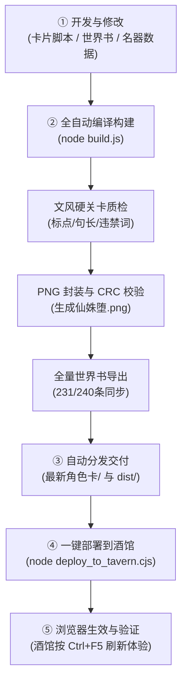

# 《仙姝堕 · 一张跑全书》项目架构与工程索引 (README.md)

> **工程根目录**：`E:\角色卡制作\仙姝堕\`  
> **项目定位**：SillyTavern (酒馆) 顶级全书群像跑书角色卡。内置 240 条精准剧情/势力/人物/名器世界书、全阶段动态立绘与玄鉴内嵌、零外链纯离线运行、双轨多身份剧情物理隔离与状态机历时推进系统。

---

## 🧭 一秒速查地图（找什么内容，去哪个子文件夹？）

如果你需要查找特定资料或修改某个模块，请对照下表直接进入对应目录：

| 查找目标 / 业务场景 | 对应子目录 | 核心文件 / 关键指引 |
| :--- | :--- | :--- |
| **找最新成品卡片**（导入酒馆直接游玩） | [`最新角色卡/`](file:///E:/角色卡制作/仙姝堕/最新角色卡/) | 仅含 `仙姝堕.png` 与 `仙姝堕.json`，纯净无杂质 |
| **修改卡片内置脚本**（状态机、HUD面板、修改器） | [`卡片脚本/`](file:///E:/角色卡制作/仙姝堕/卡片脚本/) | `状态机.js`（记账/调度）、`状态栏面板.js`（HUD产物）、`GM修改器.js` |
| **修改面板样式或模板**（CSS、微卡模板、翻面逻辑） | [`卡片脚本/_src/`](file:///E:/角色卡制作/仙姝堕/卡片脚本/_src/) | 源码模板存放于此，修改后通过构建脚本重新打包进面板 |
| **查改世界书词条主源**（剧情/人物/势力/名器词条） | [`references/`](file:///E:/角色卡制作/仙姝堕/references/) | 唯一真源主文件：`仙姝墮-世界书.json`（240条全量词条） |
| **查阅原著小说语料 / 分卷提取大纲** | [`references/raw_corpus/`](file:///E:/角色卡制作/仙姝堕/references/raw_corpus/) | 原著章节语料与剧情分卷细目 |
| **查改制卡原始文案 / 提示词 / 阶段设定** | [`src/text_data/`](file:///E:/角色卡制作/仙姝堕/src/text_data/) | 剧情大纲分段、开场白草稿、文风规则设定 |
| **查改名器数据库 / 阶段锁定义** | [`src/mingqi-db.js`](file:///E:/角色卡制作/仙姝堕/src/mingqi-db.js) | 13 个名器四阶段（未开/初开/渐熟/极致）属性与状态锁定义 |
| **查看原始立绘大图 / 原画 / 图元素材** | [`src/assets/`](file:///E:/角色卡制作/仙姝堕/src/assets/) | 原始角色立绘、原著插图与封面原图 |
| **在浏览器离线预览 HUD 面板与立绘翻页效果** | [`tools/previews/`](file:///E:/角色卡制作/仙姝堕/tools/previews/) | 双击或本地运行 HTML 页面，即可脱离酒馆预览面板渲染 |
| **执行全套自动化质检**（查MVU残留、校验面板、文风检查） | [`tools/checks/`](file:///E:/角色卡制作/仙姝堕/tools/checks/) | 各类专用断言质检脚本（`_verify_panel_pack.mjs` 等） |
| **执行推卡与同步工具**（冷态推卡、世界书双向同步） | [`tools/pipeline/`](file:///E:/角色卡制作/仙姝堕/tools/pipeline/) | 流水线工程脚本（`_push_card.mjs`, `_clean_cards.mjs` 等） |
| **查阅制卡铁律、交接记录、避坑指南** | [`docs/`](file:///E:/角色卡制作/仙姝堕/docs/) | `交接说明.md`（项目总底账）、`错题本.md`、`制卡规范（统一版）.md` |
| **查阅酒馆助手底层 API 规范与沙箱避坑** | [`docs/TAVERN_HELPER_RUNTIME_API.md`](file:///E:/角色卡制作/仙姝堕/docs/TAVERN_HELPER_RUNTIME_API.md) | 官方 API 真实结构、跨 iframe 穿透机制、即时重绘调用（杜绝重复逆向） |
| **0.1秒秒级离线检验身份与剧情联动** | [`tools/checks/_chk_identity_sync.mjs`](file:///E:/角色卡制作/仙姝堕/tools/checks/_chk_identity_sync.mjs) | 离线仿真 4 大路径切换，瞬间核验 240 条世界书与 22 条剧情开闭 |
| **查阅历史构建版本产物** | [`dist/`](file:///E:/角色卡制作/仙姝堕/dist/) | 历史生成的各版本卡片 PNG/JSON 及世界书快照 |
| **查阅历史废弃旧方案 / 旧脚本 / 外部卡参考** | [`archive/`](file:///E:/角色卡制作/仙姝堕/archive/) | 淘汰代码、历史重构备份、旧版中间件归档 |
| **临时草稿 / 单次实验脚本** | [`scratch/`](file:///E:/角色卡制作/仙姝堕/scratch/) | 临时计算、数据抓取单次脚本 |
| **一键全流程重新编译打包** | [根目录](file:///E:/角色卡制作/仙姝堕/) | 运行 `node build.js`（自动编译卡片、封装PNG、导出世界书并自检） |

---

## 📂 各子文件夹详细职能与内容清单

### 1. `最新角色卡/` (Deliverables)
- **职责定位**：对外交付的最终纯净目录。
- **纪律约束**：严格遵循铁律 30，**严禁放入任何说明文档、世界书或素材杂质**，只保留直接导入酒馆使用的卡片。
- **包含文件**：
  - `仙姝堕.png`：内嵌 V3 外壳、V2 规范、240 条世界书、全量立绘/玄鉴与运行时脚本的角色卡图片。
  - `仙姝堕.json`：对应的纯 JSON 格式角色卡。

### 2. `卡片脚本/` (Runtime Scripts & Sources)
- **职责定位**：内置于角色卡内的前端运行时代码库。
- **包含内容**：
  - `状态机.js`：卡内核心调度引擎，负责消息去重指纹计算、历时推进、同楼修改基准重算、身份世界书动态开合、总结与结算独立解析。
  - `状态栏面板.js`：HUD 状态栏面板的最终编译产物（内置 CSS、骨架 DOM、内联字体与阶段立绘渲染逻辑）。
  - `GM修改器.js`：卡内调试指令修改器（`/gm` 指令控制台）。
  - `_src/`：面板模板源码目录，存放未压缩打包的面板模板与样式拆解源。
  - `bak/`：该目录历史重构过程中沉淀的各阶段备份文件（`.bak-*`），保持脚本根层清晰。

### 3. `references/` (Worldbook & Master References)
- **职责定位**：世界书与剧情设定的绝对主真源。
- **包含内容**：
  - `仙姝墮-世界书.json`：**全工程唯一世界书主数据源**（包含 240 条全量词条、闸门设置与正则宏）。
  - `仙姝墮-世界书（原始155条底稿）.json`：初期 155 条历史基准底稿。
  - `仙姝墮-分章提取明细.md`：原著逐章剧情大纲与关键点梳理。
  - `仙姝墮-文风提取（全篇核对）.md`：原著语言风格、句式与标点基准表。
  - `raw_corpus/`：原始语料库，包含原著小说文本。
  - `历史世界书备份/`：历次迭代的世界书版本归档。

### 4. `src/` (Source Materials & Assets)
- **职责定位**：卡片组装的核心原料与静态数据资产。
- **包含内容**：
  - `text_data/`：提示词片段、开场白文案、剧情分卷设定。
  - `assets_data/`：各阶段玄鉴立绘的映射关系与 base64 资源数据。
  - `assets/`：角色原画、封面底图等源图片素材。
  - `card_build/`：卡片组装与构建模块源码。
  - `scripts/`：素材提取与数据处理辅助脚本。
  - `mingqi-db.js`：全书 13 大名器及 48 个阶段锁状态定义的结构化数据库。

### 5. `tools/` (Tooling, Pipeline & Checks)
- **职责定位**：工程维护、自动化构建流水线与质检套件。
- **子目录划分**：
  - `pipeline/`：流水线脚本库，包含：
    - `_push_card.mjs`：冷态推卡到酒馆目录。
    - `_clean_cards.mjs`：酒馆冗余同名旧卡清理。
    - `_gen_relics_embed.mjs`：玄鉴微卡资源生成器。
    - `_reflow_longlines.mjs`：世界书超长行折行优化。
  - `checks/`：严格门禁质检脚本，包含：
    - `_verify_panel_pack.mjs`：面板脚本打包规范断言（34 项）。
    - `_chk_portrait_flip.mjs`：立绘阶段分组与翻面验收（22 项）。
    - `_chk_panel_artifact.mjs`：面板产物终点断言（33 项）。
    - `_chk_no_mvu.mjs`：非 MVU 依赖与卡片合规验收（47 项）。
    - `_chk_greetings.mjs`：开场白楼层结构体检（6 项）。
  - `previews/`：离线网页预览测试集，包含各阶段 HUD 面板离线渲染 HTML、翻面调试页。
  - `debug/`：调试辅助工具。
  - `_raw/` & `_win/`：平台底层辅助脚本。

### 6. `docs/` (Specifications, Standards & Handoff Logs)
- **职责定位**：团队协作标准、版本演进总账与避坑指南。
- **包含内容**：
  - `交接说明.md`：**最重要的全局底账**，记录了每一次需求变更、接口规范与最新技术方案。
  - `错题本.md`：高频失误与避坑铁律合集。
  - `制卡规范（统一版）.md`：全书卡片结构、词条命名、字段格式与文风标准。
  - `变更总账.md`：历史变更与功能改动明细。
  - `_卡内注释与备注清单.md`、`_闸门时点阈值表.md`、`_daowen_structure.md` 等专题技术备忘。

### 7. `dist/` (Build Artifacts Archive)
- **职责定位**：历史构建输出的各版本卡片与全量世界书归档。
- **包含内容**：包含各版本 `仙姝堕.png`、`仙姝堕.json` 及全量世界书导出快照。

### 8. `archive/` (Legacy & Deprecated Archive)
- **职责定位**：历史废弃与过时代码归档（已剥离所有 Chromium 缓存垃圾）。
- **包含内容**：旧版中间件、已淘汰的临时修改脚本、外部优秀卡片结构拆解参考。

### 9. `scratch/` (Temporary Scratchpad)
- **职责定位**：临时工作台。
- **包含内容**：一次性抓取、单次数据探查脚本与临时日志文件。

### 10. `根目录` (Entry Points & Core Configs)
- **职责定位**：全局主入口与配置核心。
- **核心文件**：
  - `build.js`：**总构建主入口**。一键自动执行：JSON组装 -> PNG封装 -> 世界书导出 -> 自动同步到 `dist/` 与 `最新角色卡/`。
  - `deploy.js` / `deploy_to_tavern.cjs`：一键推送到 SillyTavern 实例。
  - `_build_card.js`：底层卡片数据组装核心。
  - `_make_card_png.mjs`：PNG 图像 tEXt 块封装器。
  - `_write_worldbook.mjs`：独立世界书文件导出器。
  - `_chk_prose.mjs`：文风与禁用词门禁质检脚本。
  - `AGENTS.md`：智能体开发准则与环境底账。
  - `COORDINATION_NOTES.md`：多智能体协作与当前上下文状态备忘。

---

## 🔄 《仙姝堕》标准制卡与发布工作流程 (Standard Build & Release Workflow)

为了确保卡片每次修改后都能高质量、无差错地生成并在酒馆中生效，所有开发者与 AI 智能体必须严格遵循以下**四大阶段工作流程**：



### 阶段一：源码修改（明确修改边界）
* **修改运行时逻辑（记账/历时推进/世界书开合）**：修改 [`卡片脚本/状态机.js`](file:///E:/角色卡制作/仙姝堕/卡片脚本/状态机.js)。
* **修改 HUD 状态栏面板样式或弹窗模板**：修改 [`卡片脚本/_src/状态栏面板.模板.js`](file:///E:/角色卡制作/仙姝堕/卡片脚本/_src/状态栏面板.模板.js)。
* **修改名器设定与阶段描述**：修改 [`卡片脚本/_src/名器图鉴数据.json`](file:///E:/角色卡制作/仙姝堕/卡片脚本/_src/名器图鉴数据.json) 与 [`src/mingqi-db.js`](file:///E:/角色卡制作/仙姝堕/src/mingqi-db.js)。
* **修改主世界书词条与剧情门禁**：修改 [`references/仙姝墮-世界书.json`](file:///E:/角色卡制作/仙姝堕/references/仙姝墮-世界书.json)（全工程唯一世界书真源）。

### 阶段二：全自动编译构建 (`node build.js`)
在工程根目录下执行总构建脚本：
```bash
node build.js
```
该构建管线会自动串联执行以下关键步骤：
1. **编译角色卡 JSON 并执行文风硬关卡质检**（`_build_card.js`）：
   - 自动校验全卡 236 个文本单元的平均句长（基准 44 字）、逗号密度（基准 52.64/千字）、句号密度（22.86/千字）；
   - 拦截并杜绝任何违禁词与现代语感残留；
2. **封装角色卡 PNG 图像**（`_make_card_png.mjs --apply`）：
   - 将 5.8+ MB 的卡片数据与脚本通过标准 tEXt 块封装写入 PNG 底图；
   - 自动执行 `chara` 与 `ccv3` 双重解包回验及 CRC 校验；
3. **导出独立全量世界书**（`_write_worldbook.mjs --apply`）：
   - 提取卡内 240 条世界书，安全导出为独立的酒馆世界书文件；
4. **自动分发交付物至 `最新角色卡/` 与 `dist/`**：
   - **`最新角色卡/`（对外交付目录）**：流水线会自动将最新生成的卡片（`仙姝堕.png`、`仙姝堕.json` 以及全称兼容文件）无缝复制到该目录；
   - **`dist/`（历史归档目录）**：保留各版本的带时间戳快照。

> [!IMPORTANT]
> **关于 `最新角色卡/` 目录的绝对铁律与工作流保证**：
> 1. **最新成品自动落盘**：无论执行 `node build.js` 还是 `node deploy_to_tavern.cjs`，构建流水线都会自动将最新打包好的角色卡同步写入 `E:\角色卡制作\仙姝堕\最新角色卡\`；
> 2. **极致纯净**：该目录**永远仅保留 `仙姝堕.png` 与 `仙姝堕.json` 两份可直接分发的成品**，绝对严禁放入任何文档、构建日志、测试脚本或素材杂质；
> 3. **对外交付唯一源**：向玩家分享、上传网盘、备份或重新导入酒馆时，**一律且只从 `E:\角色卡制作\仙姝堕\最新角色卡\` 取文件**！
> 4. **一秒自检产物命令**：
>    ```bash
>    node -e "const fs = require('fs'); const s = fs.statSync('最新角色卡/仙姝堕.png'); console.log('最新卡片大小:', s.size, '修改时间:', s.mtime.toLocaleString());"
>    ```

### 阶段三：自动化部署至酒馆 (`node deploy_to_tavern.cjs`)
当需要将新构建的卡片推送到本地运行的 SillyTavern 实例时，执行：
```bash
node deploy_to_tavern.cjs
```
- **安全备份**：脚本会自动将酒馆当前的旧卡和旧世界书打包备份至 `characters/_卡备份_<时间戳>/`；
- **清理冲突**：自动检测并删除酒馆可能存在的历史同名冗余卡（如 `仙姝堕1.png`）；
- **覆盖更新**：将最新角色卡与独立世界书同步部署至酒馆运行目录：
  - 角色卡：`E:\tavern\SillyTavern\data\default-user\characters\仙姝堕.png`
  - 世界书：`E:\tavern\SillyTavern\data\default-user\worlds\仙姝堕.json`
- **实时断言终检**：自动验证门禁状态、专轨在册状态、物理开关出厂状态，确保未被其他进程恶意篡改。

### 阶段四：客户端生效与验收
1. 在浏览器中打开 SillyTavern，按下 **Ctrl + F5**（或 F5）强制刷新，清除前端缓存；
2. 打开角色会话，在第 0 楼点击身份按钮（如【自设】或【欢喜殿主】），观察 Toast 提示并打开左侧世界书抽屉，核验身份条目与剧情条目是否按联动规则正确翻转；
3. 点击右上角或状态栏展开**「全景名器玄鉴」**，验证全量 13 个名器是否全部展示 1~4 阶段完整内容。

---

## 🎭 身份与剧情条目全自动联动体系 (Identity & Plot Dynamic Linkage)

卡片内置的 [`卡片脚本/状态机.js`](file:///E:/角色卡制作/仙姝堕/卡片脚本/状态机.js) 实现了**多身份与专轨剧情物理隔离及全自动动态翻转机制**：

### 1. 联动规则全景对照表

| 用户选择的身份 | 开启的【身份】条目 | 关闭的【身份】条目 | 开启的【剧情】条目 | 关闭的【剧情】条目 | 核心设计意图 |
| :--- | :--- | :--- | :--- | :--- | :--- |
| **赵无忧**<br>*(默认主角)* | `【身份】赵无忧` | 自设、四大殿主<br>*(共 5 条)* | **主线剧情 1-15 独占**<br>*(共 15 条)* | 自设专轨（3条）<br>殿主专轨（4条） | 严格走原著赵无忧正规剧情大纲，杜绝专轨剧透 |
| **自设**<br>*(玩家原创散修)* | `【身份】自设` | 赵无忧、四大殿主<br>*(共 5 条)* | **自设专轨 3 条**：<br>· 起获《极乐引》<br>· 散修大势与秘境暗涌<br>· 仙姝名器之机缘大势 | 赵无忧主线 1-15<br>殿主专轨（4条） | 为散修量身打造机缘线，跳过赵无忧专属宿命绑死事件 |
| **四大殿主**<br>*(欢喜/焚欲/浊龙/魂欢)* | 选中的该殿主身份<br>*(1 条)* | 其余 3 位殿主、赵无忧、自设<br>*(共 5 条)* | **统一殿主专轨 4 条**：<br>· 天姝初立 · 极乐大诏<br>· 暗度天溪 · 围城之谋<br>· 要塞陷落 · 趁乱截击<br>· 极乐分疆 · 四殿割据 | 赵无忧主线 1-15<br>自设专轨（3条） | 站在天姝会执掌者与宗门收割者视角，掌控大局与鼎炉纷争 |

### 2. 底层运行与保障机制
1. **穿透式宿主 API 探测**：通过 `getGlobalOrParent(name)` 穿透酒馆助手的独立 iframe 沙箱（`about:srcdoc`），跨层级依次从 `window`、`TavernHelper`、`parent.TavernHelper`、`top.TavernHelper`、`window.parent`、`globalThis` 获取函数，彻底杜绝局部词法 `ReferenceError` 导致 API 静默降级的问题；
2. **目标世界书多维解析**：兼容 `getCharWorldbookNames('current')` 返回的 `{ primary, additional }` 对象结构，并穿透读取 `window.parent.SillyTavern.getContext()`，结合模糊匹配实现 100% 锁定目标世界书；
3. **双轨落盘与强制即时重绘**：优先调用 TavernHelper `replaceWorldbook(wb, es, { render: 'immediate' })` 强制通知酒馆即时渲染，并自动回退至 SillyTavern 原生 `saveWorldInfo` 兜底落盘；同时自动双写 `enabled` 与原生 `disable` 属性；
4. **抽屉 UI 联动刷新**：状态机主动检测主文档的 `#world_editor_select`（世界书抽屉），若玩家正打开该书，自动触发 jQuery `.trigger('change')` 重新绘制列表；Toast 实时提示同步结果。

---

## 📜 原著还原与百花榜角色规范（严禁胡编乱造）

为维护《仙姝堕》原著严谨设定，所有剧情与人物条目必须恪守原著真源，**严禁凭空捏造尊号、称号与宗门归属**：

### 百花榜六大核心仙姝法定台账

| 仙姝姓名 | 原著法定归属宗门 | 尊号 / 称号 | 核心名器 / 特质 | 原著关键定位与剧情节点 |
| :--- | :--- | :--- | :--- | :--- |
| **孤月** | **墨山道** | 孤月仙子 / 剑峰大师姐 | **九幽玄阴穴** | 墨山道掌门首徒，清冷如雪，与赵无忧两情相悦；邪修洞府解毒、赠冰心泪送别、为救赵无忧赴中洲 |
| **叶红缨** | **残阳宗**（后遭围猎陷落） | 赤羽仙子 | **灼酒流炎穴** | 烈如纯阳焰火，天溪城血战力竭被擒；朱樱逢劫当众暴露封元镇灵环，洞府调教沦为雀奴 |
| **闻观语** | **天音阁** | 观语仙子 / 茶道雅姝 | **心魔茶璎乳** | 烹茶论道、心思通透，以茶道入心魔；天姝会大劫中陷落 |
| **楚灵夜** | **极阴宗 / 积云禅林关联** | 菩提玄女 / 灵夜仙子 | **般若菩提菊** | 积云古寺逢难，佛魔一体，名器觉醒于积云古寺惨烈杀局 |
| **苏瑶** | **天音阁** | 听雪双姝 · 姐姐 | **灵犀同心穴**（双姝共构） | 与苏玲姐妹心意相通、同心异体；初入天溪，后遭种下奴种并以「黑日」「霜月」之身回归 |
| **苏玲** | **天音阁** | 听雪双姝 · 妹妹 | **灵犀同心穴**（双姝共构） | 与苏瑶形影不离，魅骨生香；天溪城破前后与赵无忧同寝，后双姝身心沉沦 |

> [!CAUTION]
> **防虚构纪律**：严禁 AI 混淆宗门关系（如将天音阁双姝误写给墨山道，或将残阳宗叶红缨误写给合欢宗）；名器阶段与事件推进必须严格依照 [`src/mingqi-db.js`](file:///E:/角色卡制作/仙姝堕/src/mingqi-db.js) 与 [`references/仙姝墮-世界书.json`](file:///E:/角色卡制作/仙姝堕/references/仙姝墮-世界书.json) 的定义放行！

---

## 🚀 常用开发与构建命令清单

在项目根目录（`E:\角色卡制作\仙姝堕`）打开终端执行：

### 1. 一键全流程编译构建（常用）
```bash
node build.js
```
> 执行后会自动执行文风检查、卡片封装、PNG 生成、世界书提取，并将最新卡片自动同步至 `最新角色卡/` 与 `dist/`。

### 2. 一键部署至本地酒馆（带备份与终检）
```bash
node deploy_to_tavern.cjs
```
> 自动备份酒馆旧卡、部署新卡与世界书、执行实时合规终检（门禁、专轨、物理开关状态）。

### 3. 自检卡内打包脚本功能（核查状态机）
```bash
node -e "const fs = require('fs'); const card = JSON.parse(fs.readFileSync('最新角色卡/仙姝堕.json', 'utf8')); const sm = card.data.extensions.tavern_helper.scripts.find(s => s.name === '状态机'); console.log('状态机大小:', sm.content.length, '穿透探测:', sm.content.includes('getGlobalOrParent'), '即时渲染:', sm.content.includes('render: \'immediate\''));"
```

### 4. 运行核心质检套件
```bash
# 0.1秒秒级离线检验身份与剧情联动（4组用例 + 240条世界书）
node tools/checks/_chk_identity_sync.mjs

# 检验世界书防递归与 Token 防爆（全卡常驻/剧情 100% 开启阻止递归）
node tools/checks/_chk_recursion.mjs

# 检验面板脚本打包完整性（34项）
node tools/checks/_verify_panel_pack.mjs

# 检验立绘阶段与翻面逻辑（22项）
node tools/checks/_chk_portrait_flip.mjs

# 检验卡片合规性与非MVU架构（47项）
node tools/checks/_chk_no_mvu.mjs

# 检验开场白与身份菜单（6项）
node tools/checks/_chk_greetings.mjs

# 检验文风与违禁词
node _chk_prose.mjs
```

---

## ⚡ 研发提速与性能调优指南 (Developer Velocity & Acceleration Guide)

在多身份联动与状态机排查实测中，一次任务耗时 28.8 分钟，通过数据分析揭示了真实的耗时分布：
* **编译构建打包**：仅占 **0.2%**（4 秒）；
* **酒馆部署与自检**：仅占 **1.4%**（25 秒）；
* **核心代码修改**：仅占 **7.2%**（125 秒）；
* **❌ 耗时黑洞（占 81.3%，1406秒）**：**黑盒逆向排查与环境盲测试错！**

为了使后续迭代耗时由 **~29 分钟压缩至 3~5 分钟**，所有开发者与 AI 智能体必须坚决执行以下四大提速战略：

### 战略 1：查阅已固化资产，绝对禁止重复逆向（直接砍掉 80% 耗时）
* **痛点**：此前反复在 1MB+ 的混淆压缩文件（`JS-Slash-Runner/dist/index.js`）中盲目 grep 和逆向分析函数；
* **规范**：遇到 TavernHelper 相关的 API 签名、参数传递、沙箱穿透问题，**一律直接查阅 [`docs/TAVERN_HELPER_RUNTIME_API.md`](file:///E:/角色卡制作/仙姝堕/docs/TAVERN_HELPER_RUNTIME_API.md)**，绝对禁止重新从零逆向！

### 战略 2：优先使用 0.1 秒秒级离线单测沙盒（直接砍掉 10% 耗时）
* **痛点**：此前在排查逻辑时，每次都在 `scratch/` 现场写临时测试脚本，并依赖人工开卡验证；
* **规范**：改动状态机或世界书后，直接运行：
  ```bash
  node tools/checks/_chk_identity_sync.mjs
  ```
  **0.1 秒内自动跑完 4 组身份切换用例与 240 条世界书开闭断言**，瞬间完成闭环检验！

### 3. 战略 3：批量批处理探测替代单步小碎步（压缩 50% 交互往返）
* **痛点**：探索环境时“看一眼 $\to$ 汇报 $\to$ 试一下 $\to$ 汇报”，产生 300+ 步无谓往返；
* **规范**：排查疑难杂症时，一次性编写一个聚合探测脚本，将环境变量、错误堆栈、上下文数据一次性完整输出，将排查轮次压降到 20 步以内。

### 4. 战略 4：适时开启新会话，拒绝长上下文臃肿
* **原理**：会话步数超过数百步后，长上下文会导致大模型首字延迟和推理延迟急剧上升；
* **规范**：每完成一个核心里程碑（如当前多身份联动已彻底解决并完成交接），**在完成交接记录后开启新会话轻装上阵**，新会话直接读取 `COORDINATION_NOTES.md` 与 `README.md`，即可立即恢复秒级思考响应。

