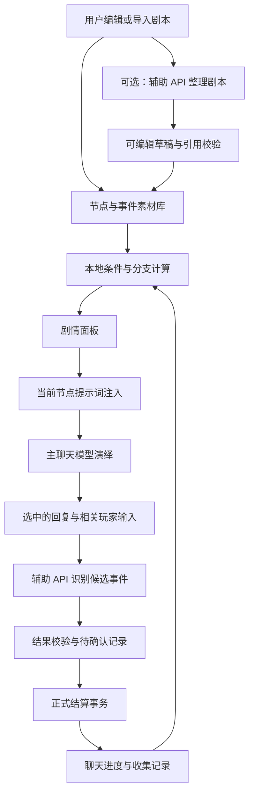

# 酒馆分支剧本插件：需求归纳与设计思路

版本：原始设计草案 0.1，保留作需求和设计记录。插件现已实现至 v1.1.1；实际安装、功能边界与验证状态以仓库 README 为准，本文中的“尚未实现”描述原始设计阶段。

## 1. 需求归纳

插件沿用 TSE 的酒馆助手脚本导入形式，通过提示词注入，让详细剧本在多轮聊天中逐步演绎。它管理剧情节点、分支、收集记录、关系变量和解锁条件；主聊天模型承担正文演绎，独立辅助 API 承担必要的语义识别。

已确认的需求：

- 支持几百到上千字的详细剧情，以及大量事件、节点和分支。
- 分支可以分叉、合流或进入不同结局。
- 支持条件解锁：同时获得 A、B 才进入 C；只有 A 时进入 D；只有 B 时进入 E。
- 保存长期进度，用短且稳定的 ID 代表长文本，区分访问、完成和收集。
- 完整素材保存在酒馆世界书，聊天进度保存在聊天作用域变量。
- 每轮只注入当前节点需要的剧情和少量相关状态。
- 保留充分的自定义入口，让用户录入、修改和批量导入事件及条件。
- 支持用户手动分段，也提供“调用模型整理大段剧本”的可选功能。
- 辅助模型通过独立 API 接入，不继续考虑本地模型部署。
- 辅助模型识别自然语言事件，脚本执行确定性的记录、奖励和解锁规则。
- 可扩展好感度、信任度、道具和任务状态等变量，并供状态栏读取。

本文把“自定义端口”理解为事件录入入口、可扩展规则和外部事件接入接口；网络连接另由 API 配置管理。

## 2. 核心边界

| 组件 | 职责 |
| --- | --- |
| 主聊天模型 | 按当前剧情指引演绎角色与正文 |
| 辅助 API：事件识别 | 从对话中识别候选事件的发生情况，返回原文依据 |
| 辅助 API：剧本整理 | 根据用户原文生成可编辑的节点、短指引和连接草稿 |
| 本地脚本 | 存储、条件计算、奖励、去重、分支选择、提示词注入和界面 |
| 用户 | 编辑规则、选择分支、确认不确定事件、修正拆分结果 |

插件能严格控制入口是否开放、哪些文本进入提示词、变量如何变化。模型正文是否完全遵守剧情边界，需要通过提示词与实测来改善，不能仅凭按钮锁定保证。

事件识别与规则执行分开。例如，辅助模型识别“赠花已经完成且对方接受”，脚本再执行预设的好感度 +1。辅助模型不直接指定任意数值变化，也不直接改写当前剧情节点。

## 3. 总体结构



## 4. 数据分层

### 4.1 素材库：世界书

建立专用世界书或插件管理的条目组，分别保存项目说明、剧情节点、预设事件和变量定义。用户其他世界书保持原有用途。

插件素材条目关闭原生自动激活，由插件通过适配层读取。模型整理功能默认只创建草稿，不覆盖用户原文。条目保存完整内容，插件建立运行时索引。

每个剧情节点保存：

- 稳定 ID、显示名称和标签。
- 详细剧情原文。
- 供当前轮注入的短演绎指引。
- 必须保留的线索、当前阶段的揭露边界。
- 完成方式、完成效果、可选出口及其条件。
- 素材版本及原文来源。

“详细剧情”和“短演绎指引”分别编辑。脚本不会自动理解并压缩长文本；短指引由作者填写，或在整理阶段由辅助模型生成。涉及必要细节的轮次可以按配置注入详细段落，并显示预计输入长度。

### 4.2 聊天进度：聊天作用域变量

建议使用单独命名空间 `branch_story_engine`，按项目 ID 保存状态：

```json
{
  "schema_version": 1,
  "project_id": "story_hotel",
  "project_revision": "rev_001",
  "current_node_id": "N001",
  "visited_node_ids": ["N001"],
  "completed_node_ids": [],
  "collected_ids": [],
  "variables": {
    "affinity_guest_01": 0,
    "power_restored": false
  },
  "committed_message_id": null,
  "pending_checks": []
}
```

运行时可将 ID 集合转换为 Set 或映射，持久化时使用可序列化的数据。完整剧情正文不复制进聊天进度。

访问节点不等于完成节点，完成节点也不必然获得收集项；由作者配置对应效果。不同聊天独立推进。

### 4.3 API 与界面设置

API 连接配置、界面偏好与剧情分享包分离。导出默认不含密钥。事件识别和剧本整理可以使用同一个连接，也可以指定不同模型。

撤销所需的操作日志使用有限窗口或检查点。长期收集记录保留，不能为节省空间随意删除仍参与条件判断的记录。近期回退与任意历史消息删除后的完整恢复，是不同能力，界面应说明可恢复范围。

## 5. 自定义事件与扩展入口

### 5.1 事件编辑器

每个事件提供以下字段，不限制用户只能从内置事件模板中选择：

| 字段 | 用途 |
| --- | --- |
| ID、名称、标签 | 短 ID 用于逻辑，长名称用于展示 |
| 事件描述 | 描述需要识别的行为或结果 |
| 完成标准 | 明确何时可以记为完成 |
| 排除情况 | 如请求、计划、假设、拒绝、引用旧事 |
| 主体和对象 | 限定玩家、角色或允许的对象集合 |
| 适用范围 | 当前节点、指定场景、项目全局等 |
| 前置条件 | 哪些状态下该事件才参与识别 |
| 完成效果 | 收集、变量增减、标志设置等 |
| 重复策略 | 一次性、每轮一次、限次数或带冷却 |
| 结算方式 | 手动、明确节点触发、辅助 API 识别 |

示例：

```json
{
  "id": "E_GIFT_FLOWER",
  "title": "赠花并被接受",
  "description": "玩家把花赠予指定角色，对方实际接受。",
  "completion_criteria": "交付与接受已经发生，而非仅提出请求。",
  "exclusions": ["计划赠花", "对方拒绝", "引用往事", "只是谈论花"],
  "actor_id": "player",
  "recipient_id": "guest_01",
  "scope": {"kind": "project"},
  "repeat_policy": "once_per_accepted_turn",
  "effects": [
    {"add": {"variable": "affinity_guest_01", "value": 1}}
  ]
}
```

### 5.2 用户录入方式

- 表单逐个编辑事件、剧情节点、条件和效果。
- 从事件模板创建，随后修改名称、对象、完成标准和数值。
- JSON 批量导入、导出；导入前检查结构和引用，展示新增与覆盖范围。
- 自由文本输入事件要求，选择“辅助模型整理为事件规则”，得到可编辑草稿。
- 手动确认事件发生，用于纠正识别结果或完全不调用模型的模式。

提供基础表单和高级 JSON 编辑两种入口。支持自定义标签、变量和元数据；条件和效果采用声明式结构，不通过执行任意字符串代码扩展。

### 5.3 外部接入接口

设计稳定的事件提交接口，供用户按钮、其他酒馆助手脚本或状态栏提交预设事件 ID、主体、来源消息和唯一操作 ID。进入统一结算通道，执行相同的前置条件、重复检查与记录逻辑。

接口只接受已注册事件。具体采用酒馆助手事件机制还是导出的调用函数，在核对目标版本能力后确定。

## 6. 分支条件与节点完成

条件编辑器提供“全部满足、任一满足、排除条件”，并支持收集项、已完成节点、已访问节点和变量比较。

```json
{
  "all": [
    {"collected": "A"},
    {"collected": "B"}
  ]
}
```

“只有 A”的条件：

```json
{
  "all": [
    {"collected": "A"},
    {"not": {"collected": "B"}}
  ]
}
```

其他条件包括 `any`、`completed`、`visited` 和带明确比较符的 `variable`。多个出口同时可用时，默认由用户选择；不默默挑选第一个结果。

节点完成可配置为手动确认、明确脚本事件触发或辅助 API 识别完成条件。奖励在正式结算时发放。分支入口开放与自动跳转分开：默认解锁后展示可用入口，不强迫角色直接跳到下一段剧情。

点击入口时再次检查条件。图结构校验检查不存在的引用和不可达节点；合法循环允许存在，并配合重复策略运行。

## 7. 大段剧本的可选模型整理

编辑页提供两条路径：手动建立节点，或选择“使用辅助 API 整理长文本”。第二条路径可调整：

- 按事件或场景分段，以及大致阶段数、详细程度。
- 单线结构或提取原文中已有的分支。
- 是否生成短演绎指引、完成条件草稿和可识别事件草稿。
- 是否允许提出原文之外的新分支；默认保留原文已有内容。

流程：保留原文 → 调用整理 API → 结构校验 → 展示节点草稿及原文对照 → 用户编辑并应用。

模型使用临时节点编号，正式 ID 由脚本生成并统一映射所有连接。检查引用、重复 ID、来源对应和遗漏内容。模型推测的条件或新增分支标为建议，不能伪装成原文明确设定。

整理请求只在用户主动操作时执行，结果保存后复用。修改节点不会自动重新请求全文整理。超长原文分批处理，保留交界处上下文，最后合并并检查连接；显示处理进度、用量和失败批次。

## 8. 辅助 API 的事件识别

### 8.1 连接配置

第一版优先支持 OpenAI 兼容的 Chat Completions 接口，配置地址、模型、密钥、超时、输入输出预算和结构化输出选项。提供一次连接测试。

优先使用独立请求适配器，不通过主聊天生成流程发起辅助调用，避免触发聊天写入、剧情注入或重复事件。浏览器跨域能力与酒馆助手支持的请求路径必须在实现时验证；若目标服务无法被当前脚本调用，应给出具体原因，而不是默认所有 API 地址均可直接连接。

如使用酒馆助手生成接口作为适配路径，必须隔离辅助任务的提示词与生成事件，避免将其当作正常角色回复处理。

### 8.2 输入与输出

输入为近期已选择的对话、相关人物身份、少量已知事实，以及当前候选事件的描述、完成标准和排除情况。辅助模型只判断事件，不演绎剧情。

示例返回协议：

```json
{
  "results": [
    {
      "event_id": "E_GIFT_FLOWER",
      "status": "proposed",
      "actor_id": "player",
      "recipient_id": "guest_01",
      "evidence": [
        {
          "message_id": "42",
          "quote": "请允许我为您将它插在头上"
        }
      ]
    }
  ]
}
```

状态枚举：`completed`、`proposed`、`rejected`、`not_occurred`、`uncertain`。只有满足预设完成标准的 `completed` 进入自动结算。判断不明确时提供人工确认。

脚本检查结构、事件白名单、主体对象、来源消息和引文是否存在，并按事件定义应用效果。引文校验不能证明模型的语义判断必然正确；仍需要事件样例评估。模型不返回任意奖励数值，也不输出可执行代码。

### 8.3 用量控制与覆盖范围

- 按项目、当前节点、场景、人物、前置条件和一次性完成状态筛选候选。
- 关键词可作辅助排序，不作为自然语言事件识别的唯一依据。
- 一次请求判断多个候选，限制输出长度，使用非思考模式或供应商支持的低推理配置。
- 不发送完整剧本、完整事件库或长期聊天历史。
- 以服务返回的 usage 统计实际消耗；未返回时显示估算，不混称精确计费。

预算会限制一次检查的事件数。候选过多时分批排队，显示未检查范围；尚未检查的事件不能标为“没有发生”。用户可调整全局事件组的适用范围，避免每轮检查全部预设。

优先保留完整的相关对话，超长文本需分段并带必要上下文，不能直接截掉尾部后声称完成全面识别。低 Token 成本与全局事件的完整覆盖存在取舍，界面应显示本次检查范围。

## 9. 回复草稿、正式结算与异步流程

采用 TSE 的两阶段思路，并明确绑定消息及候选版本：

1. AI 回复到达：保存草稿引用；可按设置延迟预检查。
2. Swipe 或重生成：更新当前候选，旧候选结果不直接生效。
3. 用户接话或点击确认：将选中的回复作为结算对象；已有匹配预检查结果可复用，否则发起一次检查。
4. 校验结果与来源版本：按顺序结算，更新记录和变量，重新计算出口。
5. 下一次生成：根据已正式提交的状态构建当前剧情指引。

每个请求绑定会话 ID、项目版本、用户输入与回复指纹、候选版本和状态修订号。旧会话、旧候选或已被手动修正的结果不可直接覆盖新状态。

事件结算保存唯一事务 ID，并按重复策略去重。同一回复的重复事件通知、重复 API 返回和页面恢复均不能重复奖励。

严格等待与响应速度分别提供设置：需要新结果决定下一段时，可在生成前等待一个配置上限；超时保持相关解锁待定并提供提示。快速模式使用现有已确认状态生成，后续结果影响下一轮，不能宣称该轮已应用尚未返回的判断。

同楼层重生成与 Continue 使用消息角色、候选版本及相邻消息判定，不仅依靠楼层差。删除历史、重置或回退需要按可恢复的检查点处理，不能只移动当前节点却保留已经撤销的奖励。

## 10. 主聊天提示词与状态栏

注入内容由模板组装：当前节点短指引、必要角色、相关事实、已允许揭露的线索及作者指定的演绎要求。进入当前节点需要的详细段落可按配置加入。

插件仅管理自身的注入 ID。生成前同步当前快照，关闭或暂停时撤销自身注入。素材书中的其他分支不自动进入主模型上下文。

关系变量定义包含名称、默认值、数值范围和更新规则。状态栏可以通过变量读取或更新通知刷新。字段只展示已提交状态，也可额外显示“等待判断”。具体适配现有状态栏还是提供插件自己的状态展示，在实现前核对目标状态栏格式。

“好感度增加”作为一次规则效果，不需要主模型再做数值运算。自由聊天是否构成一次有效关系事件，由辅助识别或人工确认决定。

## 11. 剧情面板

建议包含以下页面：

- 运行：当前节点、可用分支、暂停、确认完成、近期回退。
- 剧本：世界书绑定、节点编辑、连接和条件、全文整理入口。
- 事件：自由录入、模板、批量导入、作用范围、完成标准和效果。
- 记录：访问、完成、收集、关系变量、待确认事件及来源依据。
- API：独立连接、识别与整理模型、连接测试、用量预算。
- 数据：备份、导入导出、项目版本与迁移说明。

面板优先显示易读名称，短 ID 放在高级信息中。大型列表使用搜索、筛选和分页；当前运行页只显示相关出口。锁定原因可以显示缺少的条件，并提供隐藏未来分支名称的选项。

## 12. 性能与数据一致性

静态条目加载后建立索引，素材发生变化时刷新。每轮判断当前出口和候选事件，避免重复读取并扫描全文素材库。

进度只保存简短 ID、变量和有限事务信息。状态变化时才保存，合并短时间内的重复写入。即使集合查询很轻，大状态的序列化和保存仍会增长，应监测而非假设零成本。

编辑文本保留节点 ID。导入时检查项目身份、ID 冲突和所有引用；重建 ID 时同步映射连接、条件和效果。涉及已有进度的结构变更提供迁移预览，不能默默清空收集记录。

辅助请求串行或按因果顺序提交；不把晚到的旧判断当作最新事实。失败、超时、取消与未检查分别展示，不变成成功或未发生。必要时通过人工确认继续。

## 13. 模块划分

以下是计划模块，尚未创建实现文件：

| 模块 | 职责 |
| --- | --- |
| `host_adapter` | 酒馆助手事件、变量、世界书及注入 API 适配 |
| `project_store` | 素材读取、索引、版本与导入导出 |
| `condition_engine` | 条件计算、出口查询、图引用检查 |
| `progress_store` | 聊天进度、事务、去重及检查点 |
| `event_registry` | 自定义事件、作用范围与候选筛选 |
| `api_client` | 独立连接、结构化协议、超时与用量 |
| `event_detector` | 对话事件识别、证据与候选版本管理 |
| `script_segmenter` | 全文整理、草稿合并与来源对照 |
| `prompt_injector` | 当前节点指引与主聊天注入 |
| `ui_panel` | 编辑、运行、记录、API 与数据界面 |
| `engine_core` | 事件调度与正式结算 |

保持源文件可维护，最终打包为酒馆助手可导入的 JSON。优先验证宿主版本的实际 API 契约，不直接把 TSE 的全部实现复制过来。

## 14. 实现顺序与验收

第一版范围包含自定义节点和事件编辑、条件分支、长期记录、关系变量、API 事件判断，以及可选的模型全文整理；后者作为可关闭功能保留，不从需求中省略。

实现顺序：数据契约与宿主适配 → 手动剧情和条件闭环 → 事件识别与事务 → 全文整理 → 大型编辑界面与状态栏接入 → 打包验证。

| 验收场景 | 预期结果 |
| --- | --- |
| A、B 均未获得；只有 A；只有 B；A+B | 分别对应锁定、D、E、C，无互斥条件误开 |
| 修改长事件名称或正文 | 稳定 ID 与已有记录保持对应 |
| 赠花请求、实际赠予、拒绝、引用旧事 | 能区分事件状态；不确定结果留待确认 |
| 同一完成消息重复通知或返回 | 不重复奖励 |
| Swipe 后旧 API 结果晚到 | 不结算被替换的候选 |
| 快速切换聊天 | 两个聊天的进度和请求结果独立 |
| API 超时或预算不足 | 相关状态待定，不误解锁、不伪报全面检查 |
| 全文整理包含错误连接或遗漏 | 显示草稿问题，原文保留 |
| 导入带悬空引用或 ID 冲突 | 给出定位信息，不静默破坏现有项目 |
| 许多节点但当前出口很少 | 不每轮重复扫描全部正文，不把完整库注入模型 |
| 导出分享包 | 包含剧情规则与必要元数据，不含 API 密钥 |

条件、去重、迁移和事务以确定性测试验证。事件识别另外建立少量覆盖否定、意图、完成、对象、时序和隐喻的评估对话，记录误判与漏判；它们是验收样例，不等于训练模型。真实酒馆中再验证事件顺序、生成前注入、世界书读取与 API 连通性。

## 15. 实现前仍需确定的细节

- 目标酒馆助手版本及现有状态栏的读取方式。
- 用户准备使用的辅助 API 服务、模型和结构化输出支持。
- 事件是否默认自动结算，还是识别后由用户确认；建议可按事件覆盖。
- 分支默认手动进入，或在仅有一个合法出口时允许自动推进。
- 生成前等待辅助判断的时长、快速模式以及近期回退窗口。

这些细节可作为设置和适配选择逐步落实。本文尚未执行任何 API 调用、模型整理或真实酒馆验证，也未实现插件功能。
